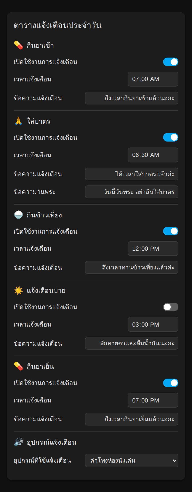
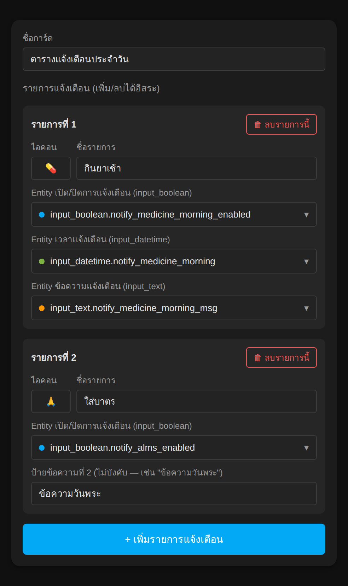

# Reminder Schedule Card

การ์ด Lovelace สำหรับจัดตารางแจ้งเตือนประจำวัน (กินยา ใส่บาตร มื้ออาหาร ฯลฯ) — สร้างขึ้นมาเพื่อแทนการต่อ `entities` card หลายๆใบเข้าใน `vertical-stack` ด้วยมือ ทำให้**เพิ่ม/ลบรายการแจ้งเตือนได้จากหน้าตั้งค่าการ์ดโดยตรง ไม่ต้องแก้ YAML**

แต่ละรายการแจ้งเตือนประกอบด้วย:
- ไอคอน + ชื่อรายการ
- สวิตช์เปิด/ปิดการแจ้งเตือน (ผูกกับ `input_boolean`)
- เวลาแจ้งเตือน (ผูกกับ `input_datetime`)
- ข้อความแจ้งเตือน (ผูกกับ `input_text`)
- ข้อความสำรองที่ 2 — ไม่บังคับ (เช่น ข้อความพิเศษเฉพาะวันพระ)

และมีแถวเลือก **อุปกรณ์ปลายทางที่จะใช้แจ้งเตือน** แยกอีกหนึ่งช่อง (ผูกกับ `input_select`)

ทุกช่องแก้ค่าได้ตรงในตัวการ์ดเลย (สวิตช์ คลิกสลับ / เวลา คลิกแล้วเลือก / ข้อความ พิมพ์แล้วกด Enter หรือคลิกออกนอกช่อง) ค่าจะถูกบันทึกเข้า helper ที่ผูกไว้ทันที — เอาไปใช้ต่อในระบบ automation/notify ของคุณได้ตามปกติ

## ภาพตัวอย่าง

> ภาพด้านล่างสร้างจาก CSS เดียวกับตัวการ์ดจริง ใส่ข้อมูลสมมติเพื่อประกอบคำอธิบาย ไม่ใช่สกรีนช็อตจาก Home Assistant จริง

**หน้าการ์ด** — ทุกแถวแก้ค่าได้ในตัวการ์ดเลย ไม่ต้องเปิด more-info

**หน้าตั้งค่า (Editor)** — เพิ่ม/ลบรายการแจ้งเตือนได้อิสระ เลือก entity ผ่าน entity picker ไม่ต้องจำชื่อ entity เอง

## การติดตั้ง

### ผ่าน HACS (แนะนำ)
1. HACS → Frontend → เมนู ⋮ มุมขวาบน → **Custom repositories**
2. วาง URL ของ repo นี้ → เลือกประเภท **Lovelace**
3. ค้นหา "Reminder Schedule Card" ในรายการ → กด **Download**
4. รีโหลดเบราว์เซอร์ (ล้าง cache ถ้าจำเป็น)

### ติดตั้งมือ
1. ดาวน์โหลดไฟล์ `reminder-schedule-card.js`
2. ก็อปไปไว้ที่ `config/www/reminder-schedule-card.js`
3. Settings → Dashboards → แท็บ Resources → **+ Add Resource**
   - URL: `/local/reminder-schedule-card.js`
   - Resource type: **JavaScript Module**
4. รีโหลดเบราว์เซอร์

## ก่อนใช้งาน — ต้องมี Helper เหล่านี้ก่อน

สร้างที่ Settings → Devices & services → แท็บ **Helpers** → **+ Create helper**

| ประเภท Helper | ใช้สำหรับ |
|---|---|
| `input_boolean` | เปิด/ปิดการแจ้งเตือนของแต่ละรายการ |
| `input_datetime` (เลือกแบบ Time only) | เวลาที่จะแจ้งเตือนของแต่ละรายการ |
| `input_text` | ข้อความที่จะส่งแจ้งเตือน (ตั้ง Maximum length ให้พอกับข้อความที่จะพิมพ์) |
| `input_select` (ไม่บังคับ) | รายชื่ออุปกรณ์/ผู้รับที่จะส่งแจ้งเตือนไปให้ |

สร้าง helper ครบตามจำนวนรายการแจ้งเตือนที่ต้องการ (รายการละ 1 boolean + 1 datetime + 1-2 text) แล้วค่อยมาตั้งค่าในตัวการ์ด

## ตั้งค่าการ์ด

เพิ่มการ์ดผ่านหน้า UI ปกติ (Add Card → ค้นหา "Reminder Schedule Card") แล้วกดปุ่ม **+ เพิ่มรายการแจ้งเตือน** ในหน้าแก้ไขการ์ด เลือก entity ของแต่ละช่องผ่าน entity picker ได้เลย ไม่ต้องจำชื่อ entity เอง

หรือจะตั้งผ่าน YAML (กด "Show code editor" ในหน้าแก้ไขการ์ด) ดูตัวอย่างเต็มได้ที่ [`examples/config.yaml`](examples/config.yaml)

### Config keys

| Key | จำเป็น? | คำอธิบาย |
|---|---|---|
| `type` | ✅ | ต้องเป็น `custom:reminder-schedule-card` |
| `title` | ไม่ | ชื่อหัวการ์ด (ค่าเริ่มต้น "ตารางแจ้งเตือนประจำวัน") |
| `items` | ✅ | ลิสต์รายการแจ้งเตือน (รายละเอียดด้านล่าง) |
| `device_entity` | ไม่ | entity `input_select` สำหรับเลือกอุปกรณ์ปลายทาง — ไม่ตั้งจะไม่แสดงแถวนี้ |
| `device_label` | ไม่ | ชื่อหัวข้อของแถวเลือกอุปกรณ์ (ค่าเริ่มต้น "อุปกรณ์แจ้งเตือน") |
| `device_icon` | ไม่ | ไอคอน/emoji ของแถวเลือกอุปกรณ์ (ค่าเริ่มต้น 🔊) |

### แต่ละรายการใน `items`

| Key | จำเป็น? | คำอธิบาย |
|---|---|---|
| `icon` | ไม่ | emoji หรือไอคอนหน้าชื่อรายการ |
| `title` | ไม่ | ชื่อรายการแจ้งเตือน |
| `enabled_entity` | ไม่ | entity `input_boolean` — ไม่ตั้งจะไม่แสดงแถวสวิตช์ |
| `time_entity` | ไม่ | entity `input_datetime` — ไม่ตั้งจะไม่แสดงแถวเวลา |
| `message_entity` | ไม่ | entity `input_text` — ไม่ตั้งจะไม่แสดงแถวข้อความ |
| `message_2_label` | ไม่ | ป้ายชื่อของข้อความสำรองที่ 2 |
| `message_2_entity` | ไม่ | entity `input_text` ตัวที่ 2 — ไม่ตั้งจะไม่แสดงแถวนี้ |

ทุก key ในแต่ละรายการเป็น optional หมด — ใส่เฉพาะแถวที่อยากให้แสดงก็พอ ถ้า entity ที่ตั้งไว้หาไม่เจอในระบบ แถวนั้นจะโชว์ "ไม่พบ entity" แทนการพังทั้งการ์ด

## หมายเหตุ

- การ์ดนี้แค่**อ่าน/เขียน state ของ helper** เท่านั้น ไม่ได้ส่งการแจ้งเตือนเอง — ต้องมี automation แยกที่ trigger ตามเวลาใน `input_datetime` แล้วเช็ค `input_boolean` ก่อนยิง `notify.*` service ไปอีกที
- ปุ่ม "เพิ่มรายการแจ้งเตือน" ในหน้าแก้ไขจะสร้างรายการเปล่าให้ก่อน ต้องไปเลือก entity ของแต่ละช่องเองหลังเพิ่ม
- รองรับ HA ตั้งแต่เวอร์ชันที่มี `ha-entity-picker` เป็น custom element มาตรฐาน (เวอร์ชันปัจจุบันทั้งหมดมีอยู่แล้ว)

**Full file list:** `reminder-schedule-card.js`, `README.md`, `RELEASE_NOTES.md`, `hacs.json`, `LICENSE`, `examples/`, `screenshots/`
